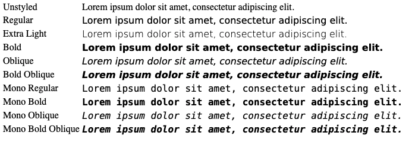

# Dejavu Sans / Mono web font

This repository provides web fonts derived from DejaVu Fonts

For license information, see [`LICENSE`](./LICENSE).

## Contents

This repository is based on <https://github.com/dejavu-fonts/dejavu-fonts>. It
focuses on four
[font faces](https://developer.mozilla.org/en-US/docs/Web/CSS/@font-face):

- DejaVu Sans
- DejaVu Sans Bold
- DejaVu Sans Bold Oblique
- DejaVu Sans Oblique
- DejaVu Extra Light
- DejaVu Sans Mono
- DejaVu Sans Mono Bold
- DejaVu Sans Mono Bold Oblique
- DejaVu Sans Mono Oblique



At Present the following unicodes are included, this can be adjusted in the build.sh script.
```
U+0000-00FF,U+2500-257F,U+25A0-25FF
```

## Building

This includes a submodule to https://github.com/dejavu-fonts/dejavu-fonts
Be sure to clone recursively or use `git submodule update --init --recursive`
after cloning.

See `dejavu-fonts/BUILD.md` for building all TTF files, installation of `fontforge` and perl `Font::TTF IO::String` is required.
Create the font files by running `make full-ttf` within the dejavu-fonts folder.

Finally, this project uses [pyftsubset](https://github.com/fonttools/fonttools) which can be installed with brew or pip.

Run `./build.sh`
